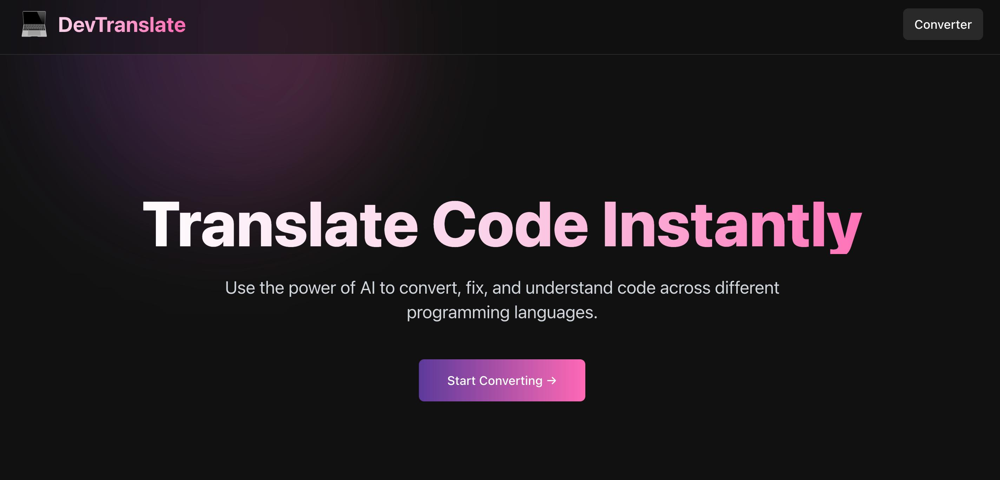
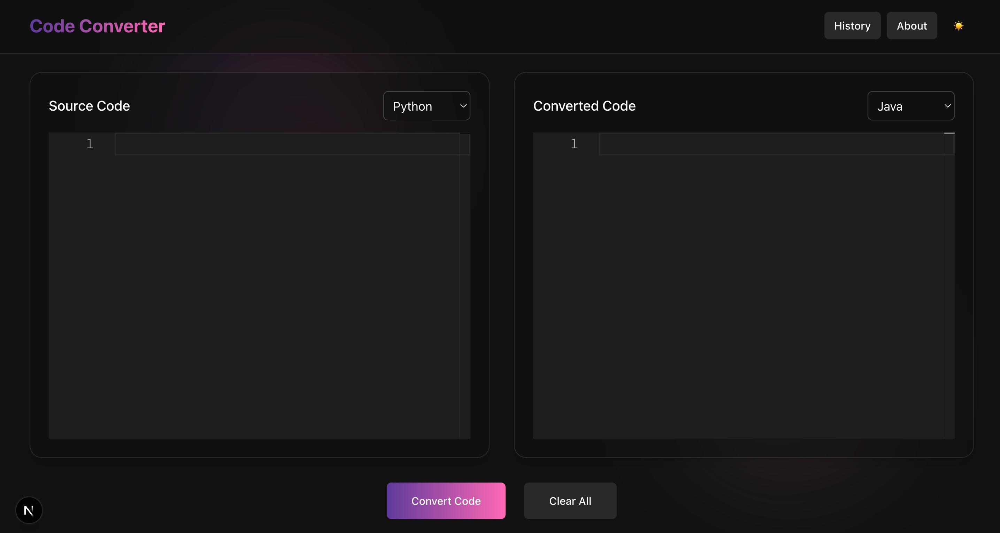
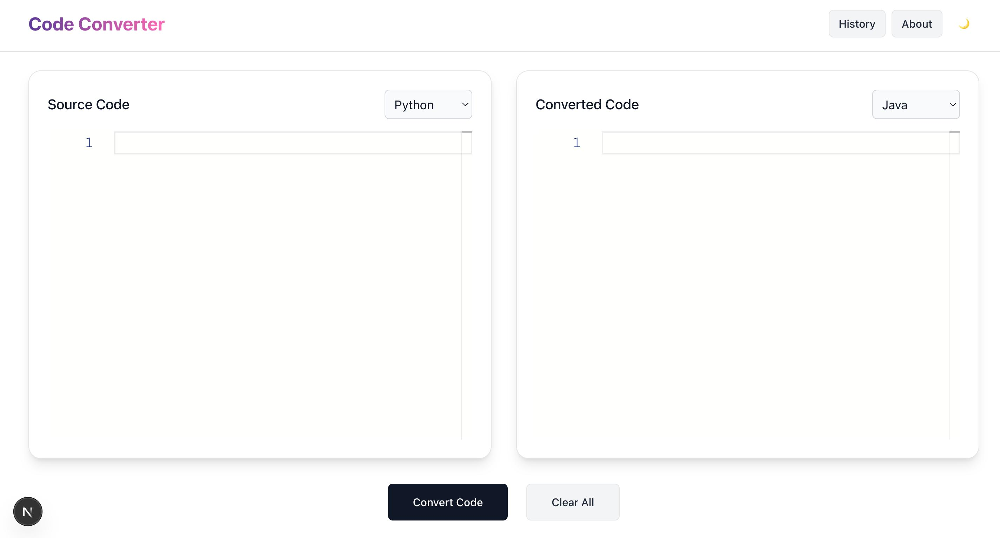
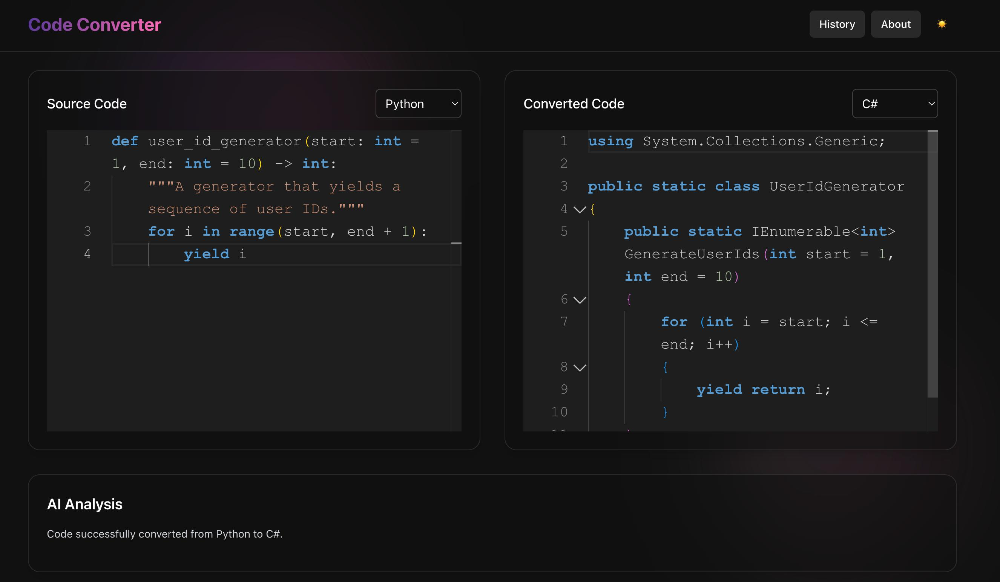
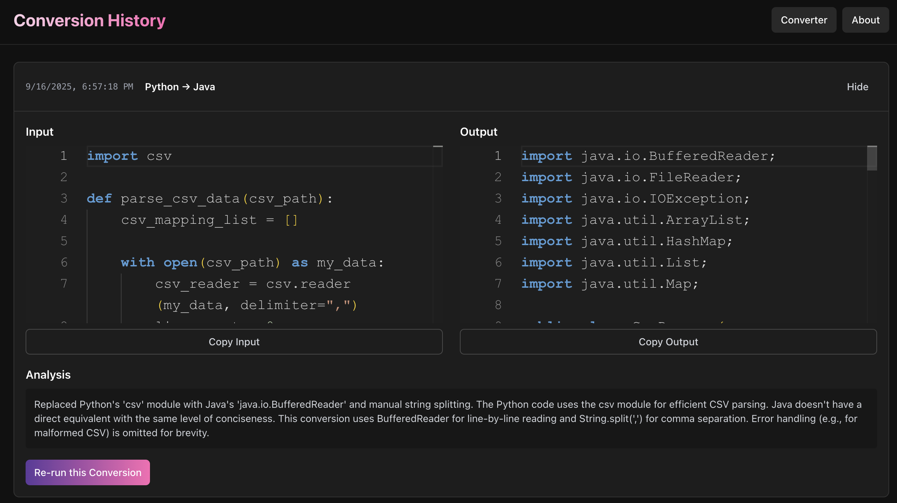

# DevTranslate: AI-Powered Code Converter

DevTranslate is a modern, full-stack web application designed to instantly convert, fix, and understand code across multiple programming languages. Powered by a securely implemented Google Gemini model, it provides a seamless and intelligent experience for developers, focusing on accuracy and security.

## 📸 Application Preview

### Landing Page
*The engaging, animated landing page that welcomes users.*


### Dark Mode Interface
*The main converter interface in a sleek, high-contrast dark theme.*


### Light Mode Interface
*The main converter interface in a clean, professional light theme.*


### Conversion Result
*A successful code conversion showing the original code, the AI's analysis, and the converted output.*


### History Page
*The client-side conversion history, allowing users to review and re-run past conversions.*


## ✨ Core Features

- **Multi-Language Code Conversion**: Translates code snippets between Python, Java, JavaScript, and C#.
- **Intelligent Syntax Fixing**: Automatically detects syntax errors in the source code and provides a corrected version with a clear analysis, streamlining the debugging process.
- **Hardened Security Model**: Features a robust, multi-step AI prompt algorithm designed to prevent prompt injection attacks. This ensures the AI's focus remains strictly on code transformation, providing a secure and reliable tool.
- **Concise & Developer-Focused Output**: The AI is specifically instructed to provide direct, line-for-line conversions where possible, avoiding unnecessary boilerplate code for a cleaner, more practical result.
- **Lightweight Client-Side History**: Utilizes the browser's localStorage for instant access to conversion history. This design choice enhances performance and simplifies setup by removing the need for an external database. Users can view past entries, copy code, and re-run conversions with a single click.
- **Adaptive Dual-Theme UI**: A sleek, responsive user interface with distinct, polished themes for both light and dark modes. All components, including the code editor, adapt to ensure high contrast and readability at all times.
- **Engaging User Experience**: Includes a visually distinct landing page with custom animations to welcome users and a professional, integrated code editor (Monaco) for a familiar editing experience.

## 🛠️ Tech Stack

| Category | Technology |
|----------|------------|
| **Frontend** | Next.js, React, TypeScript, Tailwind CSS |
| **Backend** | Node.js, Express |
| **AI Engine** | Google Gemini 1.5 Flash |
| **Code Editor** | Monaco Editor |

## 📋 Prerequisites

- Node.js (version 18.x or higher)
- A Google Gemini API Key

## 🔑 Getting Your Gemini API Key

The AI features of this application will not work without a valid Gemini API key.

1. Go to [Google AI Studio](https://ai.google.dev/).
2. Sign in with your Google account.
3. Click on the "Get API key" button in the top left corner.
4. In the dialog that appears, click "Create API key in new project".
5. Your new API key will be generated. Copy this key immediately and store it securely.
6. You will use this key in the server's environment file in the next step.

## 🚀 Local Installation & Setup

Follow these steps to run the application on your local machine.

### 1. Clone the Repository

```bash
git clone <your-repository-url>
cd <your-repository-folder>
```

### 2. Set Up Environment Variables

You need to create a `.env` file for the server.

- Navigate to the server directory.
- Create a new file named `.env`.
- Add your Gemini API key to this file:

```env
GEMINI_API_KEY=YOUR_API_KEY_HERE
```

### 3. Install Dependencies

Open two separate terminal windows or tabs.

**In Terminal 1 (for the Server):**
```bash
npm install
```

**In Terminal 2 (for the Client):**
```bash
npm install
```

### 4. Run the Application

**In Terminal 1 (to start the Backend Server):**
```bash
npm run dev
```
The server will start on http://localhost:5001.

**In Terminal 2 (to start the Frontend Client):**
```bash
npm run dev
```
The client will start on http://localhost:3000.

### 5. Access the Application

Open your web browser and navigate to http://localhost:3000.

## 🔮 Future Scope & Potential Improvements

- **Expand Language Support**: Integrate additional programming languages like Go, Rust, or Swift by updating the AI model's instructions and extending the frontend UI components.
- **Handle Whole-File Conversion**: Implement parsing the source file into logical blocks (like classes or functions), converting each block individually, and then reassembling the results into a complete target file, overcoming current AI context limits.
- **Batch File Conversion**: Introduce a feature allowing users to upload one or more source code files (.py, .java, etc.) and receive a downloadable archive of the converted files.
- **Cloud-Synchronized History**: Implement an optional user authentication system (e.g., using NextAuth.js) and a cloud database (like Supabase or MongoDB) to enable users to access their conversion history across multiple devices.